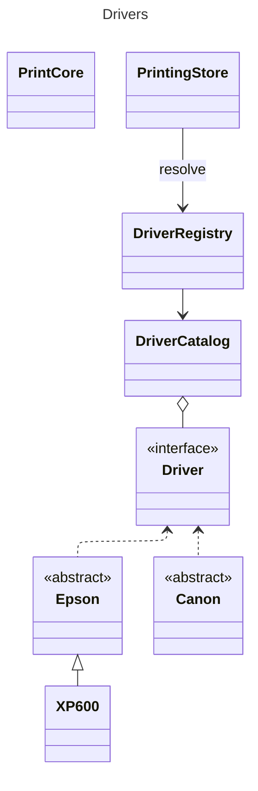
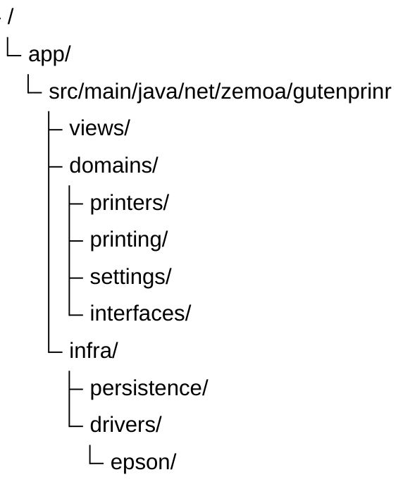

# ARCHITECTURE.md

## Purpose
This document defines the application's architectural guidelines. It must not describe implementations in detail.
It ensures the technical consistency of the entire software.
It must be readable by any technical contributor who wants to work on the project.
This document must only be edited when an architectural principle is decided.

## Technologies
- Kotlin

## Target
Android

## Architectural Principles
### State Management
All screens must be governed by state management. In other words, they react to state changes caused by actions. Screens can only communicate through actions.

A store must always refer to a functional domain.
Store actions must always refer to business actions.

The functional domains are:
- _Printers_: Store that manages discovered and saved printers.
- _Printing_: Store that manages the current print job.
- _Settings_: Store that manages global application settings.

### Drivers
The application's core must never be modified according to the printer brand and type. A plugin principle must therefore be implemented:

Drivers are independent strategies that encapsulate behavior specific to a printer family. The printing domain depends only on the `Driver` abstraction and never knows concrete implementations.

A `DriverCatalog` groups the drivers available in the application. It is built through injection from a central list defined in the application's composition. A `DriverRegistry` uses this catalog to select the appropriate driver for a printer.

Adding a driver may require changing the application's composition, but must not require modifying domains, stores, or the business core.



## Directory Organization



__views__: Contains everything related to views (reusable components and pages). Views know ONLY domains.

__domains__: Contains the stores. One package per functional domain. This is where business features are implemented. It contains the most comprehensive unit tests.

__infra__: Contains technical concerns and implementations of interfaces used by domains. Domains never depend on infrastructure implementations.

__persistence__: Contains persistence implementations.

__drivers__: Contains printer-specific code. Drivers are grouped in the `DriverCatalog` and selected by the `DriverRegistry`.

Dependencies follow this direction:

```text
views -> domains -> interfaces
infra -> interfaces
infra/persistence -> interfaces
infra/drivers -> interfaces
```

Domains may depend on technical interfaces, but never on a concrete implementation.
